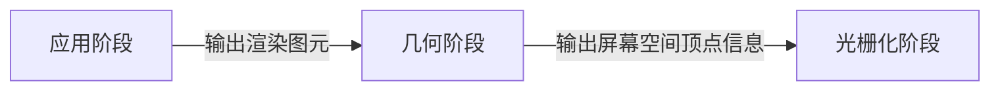
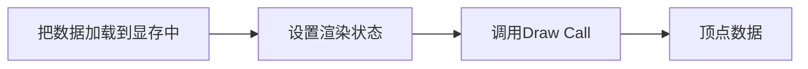
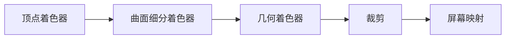
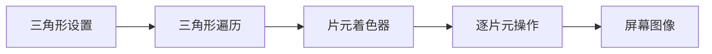

#### Shader学习笔记

Shader渲染流程分为三个阶段：
```
    1. 应用阶段（Application Stage）
    2. 几何阶段（Geometry Stage）
    3. 光栅化阶段（Rasterizer Stage）
```



应用阶段：



几何阶段：


```
顶点着色器（Vertex Shader）：
    可编程，用于顶点的空间变换、顶点着色等功能。

曲面细分着色器（Tessellation Shader）：
    可编程，可选着色器，用于细分图元。

几何着色器（Geometry Shader）：
    可编程，可选着色器，用于执行逐图元的着色操作，或被用于产生更多的图元。

裁剪（Clipping）：
    可配置，将那些不在摄像机视野内的顶点裁剪掉，并剔除某些三角图元的面片。

屏幕映射（Screen Mapping）：
    不可编程，不可配置，主要把图元的坐标转换到屏幕坐标系中。
```

光栅化阶段：


```
三角形设置（Triangle Setup）：
    不可编程，不可配置，主要是将顶点连接成三角形从而获取到三角形内所有像素的数据。

三角形便利（Triangle Traversal）：
    不可编程，不可遍历，主要是判断每个像素是否被一个三角形网格所覆盖。

片元着色器（Fragment Shader）：
    可编程，用于实现逐片元的着色操作。

逐片元操作（Per-Fragment Operations）：
    不可编程，可配置，主要执行修改颜色、深度缓冲、进行混合等操作。
```

Draw Call优化思路：
```
    1. 避免使用大量很小的网格，当不可避免地需要使用很小的网格结构时，考虑是否可以合并它们。
    2. 避免使用过多的材质，尽量在不同的网格之间公用同一个材质。
```

Unity Shader基础结构如下：
``` JavaScript
Shader "ShaderName" {
    //属性
    Properties {
    }

    //显卡A使用的子着色器
    SubShader {
    }

    //显卡B使用的子着色器
    SubShader {
    }

    FallBack "VertexLit"
}
```

Properties语义块支持的属性类型:
|属性类型|默认值的定义语法|例子|
|:----:|:----:|:----:|
|Int|number|_Int("Int", Int) = 2|
|Float|number|_Float("Float", Float) = 1.5|
|Range(min,max)|number|_Range("Range", Range(0.0, 5.0)) = 3.0|
|Color|(number, number, number, number)|_Color("Color", Color) = (1, 1, 1, 1)|
|Vector|(number, number, number, number)|_Vector("Vector", Vector) = (2, 3, 6, 1)|
|2D|"defaultTexture" {}|_2D("2D", 2D) = ""{}|
|3D|"defaultTexture" {}|_3D("3D", 3D) = "black"{}|
|Cube|"defaultTexture" {}|_Cube("Cube", Cube) = "white"{}|

SubShader的功能：
```
1. 每个Shader文件中，至少存在一个SubShader代码块，允许存在多个SubShader代码块，主要是为了针对不同的显卡做出处理，保证Shader可以在不同的机器上正常运行
2. SubShader中包含的内容：
    2.1 可选的状态（Render Setup）和标签（Tag）
    2.2 一系列Pass
        3.1 一个Pass定义了一个完整的渲染流程
        3.2 Pass中也可以定义状态（Render Setup）可标签（Tag），状态定义语法与SubShader中是一致的，但是Pass中的状态仅可在当前Pass中使用，但是SubShader中定义的状态，可以在所有Pass中使用
```

SubShader中常见的渲染状态设置选项：
|状态名称|设置指令|解释|
|:----:|:----:|:----:|
|Cull|Cull Back \| Font \| Off|设置剔除模式：剔除背面/剔除正面/关闭剔除|
|ZTest|ZTest Less Greater \| LEqual \| GEqual \| Equal \| NotEqual \| Always|设置深度测试时使用的函数|
|ZWrite|ZWrite On \| Off|开启/关闭深度写入|
|Blend|Blend SrcFactor DstFactor|开启并设置混合模式|

SubShader中的标签类型：
|标签类型|说明|例子|
|:----:|:----:|:----:|
|Queue|控制渲染顺序，指定物体属于哪一个渲染队列|Tags { "Queue" = "Transparent" }|
|RenderType|对着色器进行分类，例如这是一个透明/不透明着色器|Tags { "RenderType" = "Opaque" }|
|DisableBatching|通过该标签来指明是否对该SubShader使用批处理|Tags { "DisableBatching" = "True" }|
|ForceNoShaderCasting|控制使用该SubShader的物体是否会投射阴影|Tags { "ForceNoShaderCasting" = "True" }|
|IgnoreProjector|如果该标签值为"True"，那么使用该SubShader的物体将不会收到Projector的影响，常用于半透明物体|Tags { "IgnoreProjector" = "True" }|
|CanUseSpriteAtlas|当该SubShader是用于Sprites时，将该标签设置为"False"|Tags { "CanUseSpriteAtlas" = "False" }|
|PreviewType|指明材质面板将如何预览该材质。默认情况下，材质将显示一个球形，我们可以通过把该标签值设为"Plane"、"SkyBox"来改变预览类型|Tags { "PreviewType" = "Plane" }|

Pass中的标签类型：
|标签类型|说明|例子|
|:----:|:----:|:----:|
|LightModel|定义Pass在Unity的渲染流水中的角色|Tags { "LightModel" = "ForwardBase" }|
|RequireOptions|用于指定当满足某些条件时才渲染该Pass，目前Unity支持的选项有Vegetation|Tags { "RequireOptions" = "Vegetation" }|

坐标系：
```
坐标系分为左手坐标系和右手坐标系。在Unity中使用的是左手坐标系，但相对于观察空间（摄像机）来说，使用的是右手坐标系。
```

点积公式：
    $a · b = a_x · b_x + a_y · b_y + a_z · b_z$

叉积公式：
    $a × b = (a_x, a_y, a_z) × (b_x, b_y, b_z) = (a_y · b_z - a_z · b_y, a_z · b_x - a_x · b_z, a_x · b_y - a_y · b_x)$